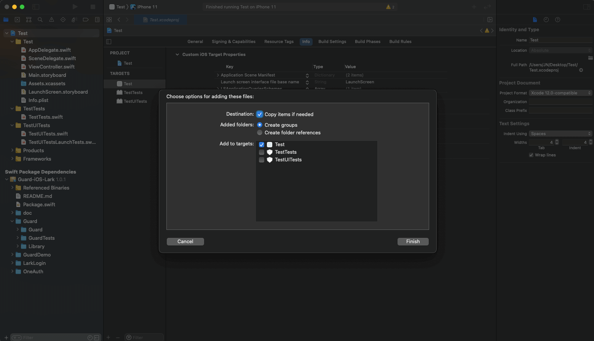
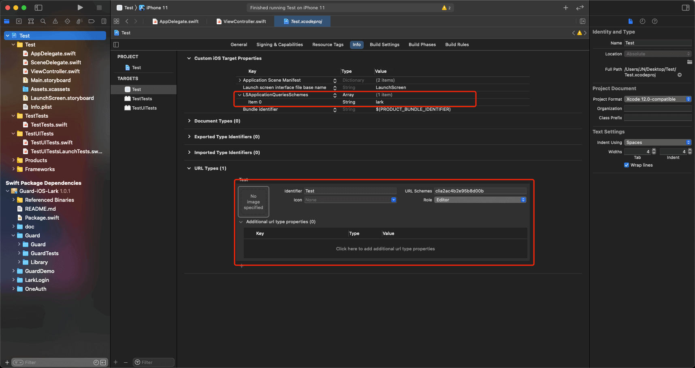

# Lark login

<LastUpdated/>

## Preparation

- For the configuration of the Authing console of the enterprise's self-built application and the Lark console, please refer to [Accessing Lark's self-built application mobile application login](https://docs.authing.cn/v2/connections/lark-internal-mobile/).

- App store app Authing console and Lark console configuration, please refer to [Access to Lark app store app mobile app login](https://docs.authing.cn/v2/connections/lark-public-mobile/).

<br>

## Integrated Lark login steps

### Step 1: Add Lark Login Component Dependency

1. Enter: https://github.com/Authing/authing-binary in the swift package search bar.

2. Select [Authing-binary](https://github.com/Authing/authing-binary).
> [Authing-binary](https://github.com/Authing/authing-binary) depends on [Guard-iOS SDK](https://github.com/Authing/guard-ios).

3. Select **Up to Next Major Version 1.0.0** for the dependency rule.

4. Check **LarkLogin**.

<br>

### Step 2: Modify project configuration

- Go to [Lark Development Platform](https://open.Lark.cn/document/uAjLw4CM/uYjL24iN/mobile-app/sdk) to download iOS LarkSS0Demo.

- Drag LarkSSO.bundle from the LarkSSO directory into the project directory, and check Copy items if needed .

- Add lark under Configuration Jump Scheme: LSApplicationQueriesSchemes Key.

- Configure Lark bounce URL: Add the app_id when registering under URL types Key (for example: clia0988c0addf81013). Note that the underscore in app_id needs to be removed.




<br>

### Step 3: Initialize Lark login

1. Add import Guard and import LarkLogin to AppDelegate or SceneDelegate.
2. Authing.start needs to pass in the application ID of Authing.
3. LarkLogin.setupLark needs to pass in the **AppId** and **Scheme** issued by the Lark Open Platform.

```swift
import Guard
import LarkLogin

Authing.start(<#AUTHING_APP_ID#>)
LarkLogin.setupLark(<#Lark App ID#>, Scheme: <#Lark Scheme#>)
  ```

<br>

### Step 4: Add Lark login callback

After Lark returns to the application, if SceneDelegate is used, the following functions need to be overloaded in SceneDelegate.swift:

```swift
func scene(_ scene: UIScene, openURLContexts URLContexts: Set<UIOpenURLContext>) {
     if let url = URLContexts.first?.url {
         _ = LarkLogin. handleUrl(url: url)
     }
}
  ```

If SceneDelegate is not used, it needs to be overloaded in AppDelegate:

```swift
func application(_ app: UIApplication, open url: URL, options: [UIApplication. OpenURLOptionsKey : Any] = [:]) -> Bool {
     return LarkLogin. handleUrl(url: url)
}
  ```

<br>


### Step 5: Issue a flight authorization

It is recommended to use the semantic Hyper Component we provide, just place one in the xib:

```swift
Lark Login Button
```

If you don't want to use our built-in button, you can call the Authing Lark login API in the click event of your own button:

```swift
LarkLogin.login(viewController: <#ViewController that presents the view#>) { (code, message, userInfo) in
     if (code == 200) {
         // userInfo: user information
     }
}
```