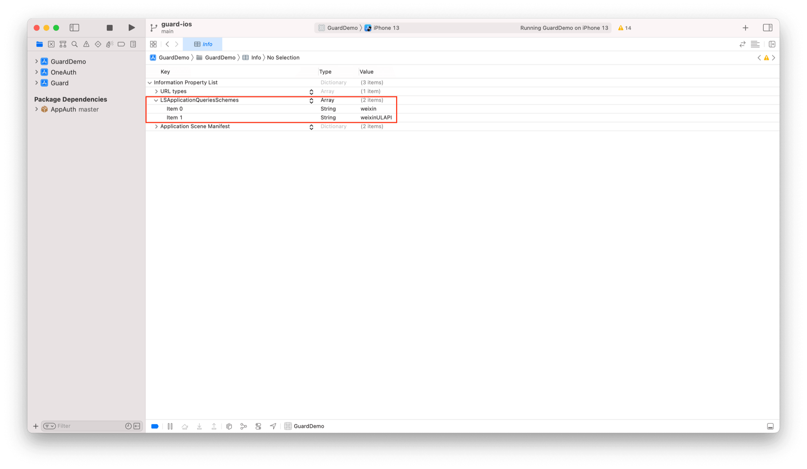

# APP Pull up the WeChat Mini Program Login

<LastUpdated/>

## Preparation

In [WeChat Open Platform](https://open.weixin.qq.com/cgi-bin/index?t=home/index&lang=zh_CN) and [Authing Console](https://authing.cn/) For configuration.

<br>

## Integrate APP Pull up the WeChat Mini Program login steps

### Step 1: Add dependencies

1. Enter: https://github.com/Authing/authing-binary in the swift package search bar.

2. Select [Authing-binary](https://github.com/Authing/authing-binary).
> [Authing-binary](https://github.com/Authing/authing-binary) depends on [Guard-iOS SDK](https://github.com/Authing/guard-ios).

3. Select **Up to Next Major Version 1.0.0** for the dependency rule.

4. Check **Wechat** after Add Package.

<br>

### Step 2: Modify project configuration

1. Add the WeChat whitelist in Info.plist

key: LSApplicationQueriesSchemes

value: weixin, weixinULAPI

> Pay attention to capitalization



You can also open Info.plist via Source Code, and then copy and paste the following code:

```xml
<plist version="1.0">
<dict>
     ...
     <key>LSApplicationQueriesSchemes</key>
<array>
<string>weixin</string>
<string>weixinULAPI</string>
</array>
     ...
</dict>
</plist>
```
2. Configure the applet bounce URL
Click the plus sign in **Targets** -> **Info** -> **URL Types**, **URL Schemes** add the AppID of the application in the WeChat development platform.

### Step 3: Initialize the Mini Program
```swift
import Guard
import Facebook

class AppDelegate: UIResponder, UIApplicationDelegate {
     func application(_ application: UIApplication, didFinishLaunchingWithOptions launchOptions: [UIApplication.LaunchOptionsKey: Any]?) -> Bool {
         Authing.start(<#AUTHING_APP_ID#>)
         Facebook.register(application, didFinishLaunchingWithOptions: launchOptions)
     }

     func application(_ app: UIApplication, open url: URL, options: [UIApplication. OpenURLOptionsKey : Any] = [:]) -> Bool {
         if "\(url)". contains(Facebook. getAppId()) {
             return Facebook. application(app, open: url, options: options)
         }
     }
}
  ```
<br>

### Step 3: Initialize the Miniprogram login
```swift
import Guard
import WechatLogin

func application(_ application: UIApplication, didFinishLaunchingWithOptions launchOptions: [UIApplication.LaunchOptionsKey: Any]?) -> Bool {
     Authing.start(<#AUTHING_APP_ID#>)
     WechatLogin.registerApp(appId: <#your_wechat_appid#>, universalLink: <#your_deep_link#>)
}
 ```
<br>

### Step 4: Handle wechat login callback

After wechat returns to the application, if SceneDelegate is used, you need to reload the following function in Scenedelegate. swift:

```swift
func scene(_ scene: UIScene, continue userActivity: NSUserActivity) {
    NotificationCenter.default.post(name: NSNotification.Name(rawValue: "wechatLoginOK"), object: userActivity)
    _ =  WechatLogin.handleOpenURL(url: url)
}
```

If SceneDelegate is not used, reload the AppDelegate:

```swift
func application(_ application: UIApplication, continue userActivity: NSUserActivity, restorationHandler: @escaping ([UIUserActivityRestoring]?) -> Void) -> Bool {
    NotificationCenter.default.post(name: NSNotification.Name(rawValue: "wechatLoginOK"), object: userActivity)
    return WechatLogin.handleOpenURL(url: url)
}
```


### Step 5: Initiate Mini Program Login Authorization
#### Mini Program authorization login

```swift
func loginByMiniProgram(_ launchMiniProgramReq: WXLaunchMiniProgramReq? = nil, completion: @escaping Authing.AuthCompletion) -> Void
```

**parameter**

* *launchMiniProgramReq* The request sent to WeChat, which includes parameters such as Mini Program originalID, page path, Mini Program version, etc. If this parameter is not passed, the original ID configured by the Authing Console App to launch the Mini Program will be used by default.
  
**example**

```swift
WechatLogin.loginByMiniProgram(launchMiniProgramReq: launchMiniProgramReq) { code, message, userInfo in
     if (code == 200) {
         // login successful
         // userInfo
     }
}
```

<br>

If the developer integrates a small program to log in to the SDK, after getting the authorization code, he can call the following API in exchange for the Authing user information:

#### Login via the Mini Program authorization code

```swift
func loginByMiniprogram(code: String, phoneInfoCode: String?, completion: @escaping(Int, String?, UserInfo?) -> Void)
```

**parameter**

* *code* The code returned by the applet wx.login()
* *phoneInfoCode* The code returned by the applet to get the phone number

**example**

```swift
AuthClient().loginByMiniprogram(code: "code", phoneInfoCode: "phoneInfoCode") { code, message, userInfo in
     // userInfo
}
```