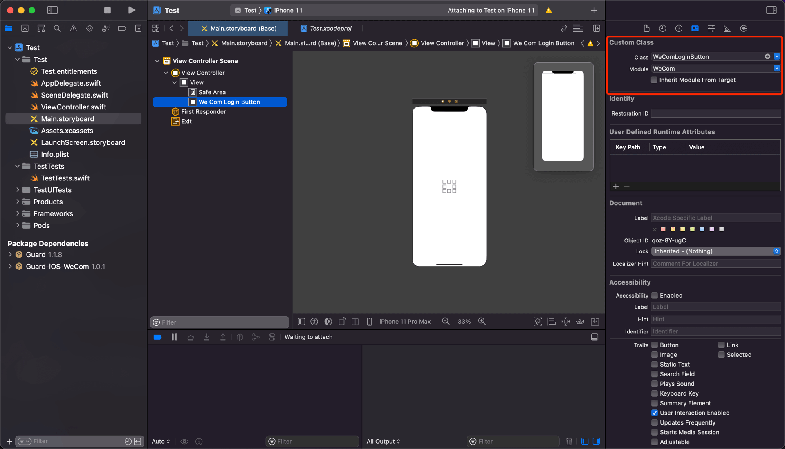

# Wecom login

<LastUpdated/>

## Preparation

For configuration in the Wecom management background and Authing management console, please refer to [Wecom mobile terminal (generation development mode)](https://docs.authing.cn/v2/guides/connections/enterprise/wecom-agency-mobile/).

<br>

## Integrated Wecom login steps

### Step 1: Add dependencies

1. Enter: https://github.com/Authing/authing-binary in the swift package search bar.

2. Select [Authing-binary](https://github.com/Authing/authing-binary).
> [Authing-binary](https://github.com/Authing/authing-binary) depends on [Guard-iOS SDK](https://github.com/Authing/guard-ios).

3. Select **Up to Next Major Version 1.0.0** for the dependency rule.

4. Check **WeCom** after Add Package.

<br>

### Step 2: Modify project configuration

- Configure jump Scheme: add wxwork and wxworklocal under LSApplicationQueriesSchemes Key

- Configure the corporate WeChat bounce URL: add the **Schema** applied for in the corporate WeChat management background under URL types Key (for example: wwauth803c38cb89ac1d57000002)


<br>

### Step 3: Initialize WeCom

1. Add import Guard and import WeCom to AppDelegate or SceneDelegate.

2. WeCom.registerApp needs to pass in the **Scheme**, **AgentID**, **CorpID** issued by WeChat Enterprise, **isProxyDevelopment** to select whether it is the agent development mode.

```swift
import Guard
import WeCom

Authing.start(<#AUTHING_APP_ID#>)
WeCom.registerApp(appId: <#Scheme#>, corpId: <#CorpID#>, agentId: <#AgentID#>, isProxyDevelopment: <#Bool#>)
  ```
 
<br>

### Step 4: Add callbacks

After Wecom returns to the application, if SceneDelegate is used, the following functions need to be overloaded in SceneDelegate.swift:

```swift
func scene(_ scene: UIScene, openURLContexts URLContexts: Set<UIOpenURLContext>) {
     if let url = URLContexts.first?.url {
         _ = WeCom. handleOpenURL(url: url)
     }
}
  ```

If SceneDelegate is not used, it needs to be overloaded in AppDelegate

```swift
func application(_ app: UIApplication, open url: URL, options: [UIApplication. OpenURLOptionsKey : Any] = [:]) -> Bool {
     return WeCom. handleOpenURL(url: url)
}
  ```

<br>


### Step 5: Initiate Wecom authorization

The SDK provides three authorization methods:

1. The developer calls the API when login is required:

```swift
WeCom.login { code, message, userInfo in
     if (code == 200) {
         // userInfo: user information
     }
}
```

2. With the semantic Hyper Component we provide, you only need to place one in the xib:

```swift
WeComLoginButton
```

Set the Module to WeCom, click the button after Build success to log in.



3. If you want to access the whole process of Wecom authorization by yourself, after getting the authorization code, you can call the following API in exchange for Authing user information:

```swift
func loginbyWeComAgency(_ code: String, completion: @escaping(Int, String?, UserInfo?) -> Void)
```

**parameter**

* *authCode* Wecom authorization code

**example**

```swift
AuthClient().loginbyWeComAgency(authCode) { code, message, userInfo in
     if (code == 200) {
         // userInfo: user information
     }
}
```