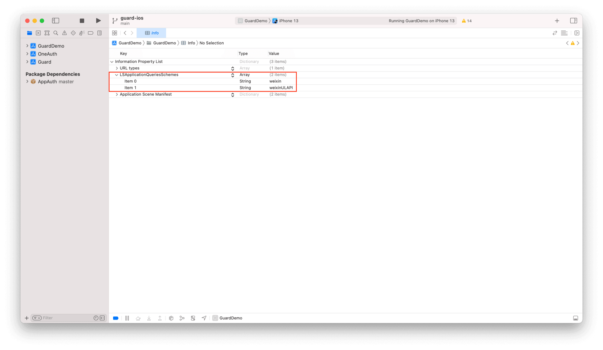

# APP 拉起微信小程序登录

<LastUpdated/>

## 准备工作

在 [微信开放平台](https://open.weixin.qq.com/cgi-bin/index?t=home/index&lang=zh_CN) 及 [Authing Console 控制台](https://authing.cn/) 进行配置，请参阅 [ APP 拉起微信小程序](../../../guides/connections/social/wechat-miniprogram-applaunch/README.md)，移动应用 APP 需要关联相关小程序。

<br>

## 集成 APP 拉起微信小程序登录步骤

### 第一步：添加依赖

1. 在 swift package 搜索栏输入：https://github.com/Authing/authing-binary 。

2. 选择 [Authing-binary](https://github.com/Authing/authing-binary)。
> [Authing-binary](https://github.com/Authing/authing-binary) 依赖于 [Guard-iOS SDK](https://github.com/Authing/guard-ios)。

3. 依赖规则选择 **Up to Next Major Version 1.0.0** 。

4. Add Package 后勾选 **Wechat** 。

<br>

### 第二步：修改项目配置

1. 在 Info.plist 里面添加启动微信白名单

key: LSApplicationQueriesSchemes

value: weixin, weixinULAPI

> 注意大小写



也可以通过 Source Code 方式打开 Info.plist，然后复制粘贴下面代码：

```xml
<plist version="1.0">
<dict>
    ...
    <key>LSApplicationQueriesSchemes</key>
	<array>
		<string>weixin</string>
		<string>weixinULAPI</string>
	</array>
    ...
</dict>
</plist>
```
2. 配置小程序回跳 URL
在 **Targets** -> **Info** -> **URL Types** 中点击加号，**URL Schemes** 添加微信开发平台中的应用 AppID。

### 第三步：初始化小程序登录
```swift
import Guard
import WechatLogin

func application(_ application: UIApplication, didFinishLaunchingWithOptions launchOptions: [UIApplication.LaunchOptionsKey: Any]?) -> Bool {
    Authing.start(<#AUTHING_APP_ID#>)
    WechatLogin.registerApp(appId: <#your_wechat_appid#>, universalLink: <#your_deep_link#>)
}
 ```
<br>

### 第四步：处理微信登录回调

微信返回应用后，如果使用了 SceneDelegate，则需要在 SceneDelegate.swift 里面重载下面的函数：

```swift
func scene(_ scene: UIScene, continue userActivity: NSUserActivity) {
    NotificationCenter.default.post(name: NSNotification.Name(rawValue: "wechatLoginOK"), object: userActivity)
    _ =  WechatLogin.handleOpenURL(url: url)
}
```

如果未使用 SceneDelegate，则需要在 AppDelegate 里面重载：

```swift
func application(_ application: UIApplication, continue userActivity: NSUserActivity, restorationHandler: @escaping ([UIUserActivityRestoring]?) -> Void) -> Bool {
    NotificationCenter.default.post(name: NSNotification.Name(rawValue: "wechatLoginOK"), object: userActivity)
    return WechatLogin.handleOpenURL(url: url)
}
```

<br>

### 第五步：发起小程序登录授权
#### 小程序授权登录

```swift
func loginByMiniProgram(_ launchMiniProgramReq: WXLaunchMiniProgramReq? = nil, completion: @escaping Authing.AuthCompletion) -> Void
```

**参数**

* *launchMiniProgramReq* 发送给微信的请求，其中包含小程序 originalID、页面路径、小程序版本等参数，如果不传此参数，默认取 Authing 控制台 App 拉起小程序配置的 originalID。
  
**示例**

```swift
WechatLogin.loginByMiniProgram(launchMiniProgramReq: launchMiniProgramReq) { code, message, userInfo in
    if (code == 200) {
        // 登录成功
        // userInfo
    }
}
```

<br>

如果开发者自己集成小程序登录 SDK，拿到授权码后，可以调用以下 API 换取 Authing 用户信息：

#### 通过小程序授权码登录

```swift
func loginByMiniprogram(code: String, phoneInfoCode: String?, completion: @escaping(Int, String?, UserInfo?) -> Void)
```

**参数**

* *code* 小程序 wx.login() 返回的 code
* *phoneInfoCode* 小程序获取手机号返回的 code

**示例**

```swift
AuthClient().loginByMiniprogram(code: "code", phoneInfoCode: "phoneInfoCode") { code, message, userInfo in
    // userInfo
}
```